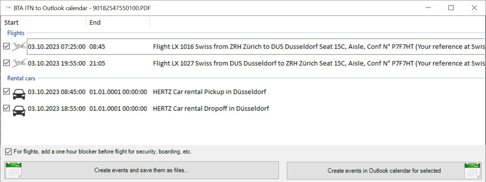

# BTA2Outlook

Extract calendar events from an BTA travel itinerary PDFs and creates ICS or Outlook calendar events for hotels, rental cars and flights.

It parses the itinerary PDF and using signal words extracts all events, displays them for review and allows to create events in your local Outlook calendar or save them to an ICS file.

Relies on the iText and bouncycastle libraries (https://github.com/itext/itextsharp and https://www.bouncycastle.org/csharp/index.html) for parsing PDF 
